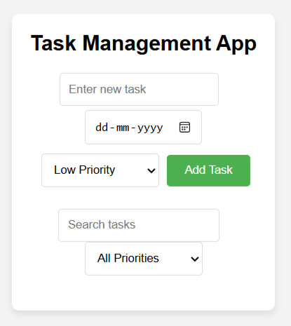

# 📝 Task Management App

A task management application built using HTML, CSS, and JavaScript, with data persistence using browser localStorage.

## 🔗 Live Demo
https://todo-app-hkaur.vercel.app

## 📌 Features
- Add, edit, and delete tasks
- Set due date and priority levels
- Search and filter tasks
- Data stored using localStorage (persists after page reload)

## 🛠️ Tech Stack
- HTML
- CSS
- JavaScript
- Local Storage (Browser)

## 📷 Screenshot

